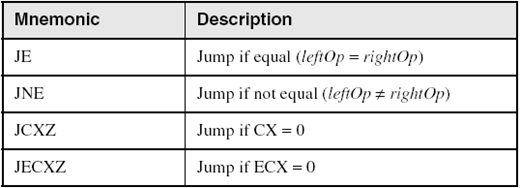
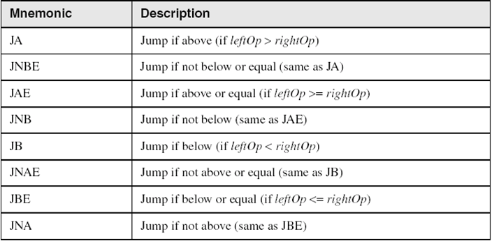
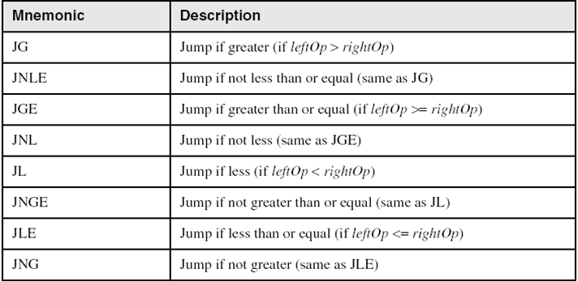

# x86 Registers

### EAX
 - Multiplication
 - Return value for function call

### EDX
 - Division

### ESP
 - Current stack pointer

### EBP
 - Base pointer for the current stack frame

### ECX
 - Repeat instructions
 - E.g. counter for loops

### ESI, EDI
 - Index register to store memory address

### EIP
 - Instruction Pointer
 - Holds memory address of next instruction to run

### Status Register (EFLAGS)
| Flag | Description |
| ---- | ----------- |
| ZF | Zero Flag set when operation result is 0 |
| CF | Carry Flag set when operation result cannot be stored |
| SF | Sign Flag set when operation result is negative |
| TF | Trap Flag – set to debug, CPU will single step |

# Data Types
| Id | Name | Size |
| -- | ---- | ---- |
| DB | Byte | 1b |
| DW | Word | 2b |
| DD | Doubleword | 4b |
| DQ | Quadword | 8b |
| DT | Ten bytes | 10b |

# Common Instructions

## Basic
 - MOV
 - LEA

## Math
 - SUB
 - ADD
 - INC
 - DEC
 - MUL
 - DIV

## Bitwise Math
 - AND
   - ZF = 1 if none of bits matches
   - ZF = 0 if at least 1 bit matches
 - OR
 - XOR
   - Useful way to invert specific bit(s) in an operand
   - Can also be used to reset stored value back to 0
 - NOT
   - Invert all the bits
 - SHL
 - ROR

## Comparisons
 - TEST 
   - Nondestructive AND operation between 2 operands
   - No operands are modified
   - Zero flag is affected
 - CMP
   - Nondestructive subtraction of source from destination
   - destination == source: ZF = 1, CF = 0
   - destination < source: ZF = 0, CF = 1
   - destination > source: ZF = 0, CF = 0

## Jumps
### Jumps Based on Specific Flags
  

### Jumps Based on Equality
  

### Jumps Based on Unsigned Comparisons
  

### Jumps Based on Signed Comparisons
  

