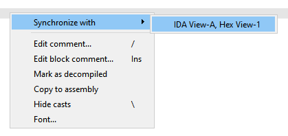
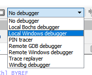
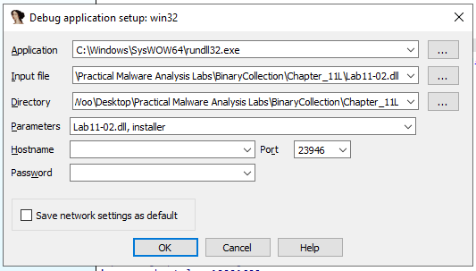
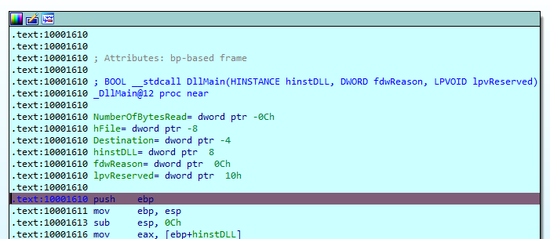

# Basic Analysis shortcuts

## Views
 - Pseudocode: `F5`
 - Strings: `Shift F12`
 - Switch between graph & text: `space`



## Functions
 - Re-analysis/Detect function: `P`
 - Set function end: `E`

## Variables
 - Rename: `n`
 - Change number base:
   - Binary (2): `B`
   - Decimal (10): `H`
   - Hex (16): `Q`
   - ASCII: `R`
 - Cross reference: `X`

## Data
 - Switch type:
   - Ascii: `A`
   - Number/DWord: `D`

## Search
 - Next Code: `Alt-C`
 - Next Data: `Ctrl-D`
 - Text: `Alt-T`

## Config
  
  

## Plugins

### Useful List
- Hex Copy
   - Simple single click to copy data as hex format
   - Shortcut: `Alt+H`
   - Link: https://github.com/OALabs/hexcopy-ida
 - Nop Selection
   - Clear selected assembly instruction or data
   - Shortcut: `Shift+N`
 - Flare IDA
   - Collection of IDA Pro scripts and plugins used by the FireEye Labs
   - Shellcode Hashes, Struct Typer, StackStrings, MSDN Annotations, ApplyCalleeType, idb2pat, argtracker, objc2_analyzer, ironstrings, Code Grafter
   - Link: https://github.com/mandiant/flare-ida
 - Interactive Functions List
   - Navigate between functions and their references
   - Shortcut: `Ctrl+Alt+F`
   - Link: https://github.com/hasherezade/ida_ifl
 - Fentanyl
   - Shortcuts to help in patching code easier
   - Link: https://github.com/osirislab/Fentanyl
 - Capa Explorer
   - Well-defined collection of rules to identify capabilities in a program
   - Install Link: https://github.com/mandiant/capa/blob/master/capa/ida/plugin/README.md

### Installation
Simply move all code for plugin into the following directory:
```
%IDA%\plugins
```

If python install is not detected properly, use `idapyswitch.exe` to select manually. 

## Debugging

### Shortcuts
 - Breakpoint: `F2`
 - Step Into: `F7`
 - Step Over: `F8`

### Run dll files
1. Select local debugger



2. Set application to `C:\Windows\SysWOW64\rundll32.exe` and parameter as `<filename>, <function>`


3. Breakpoint DLL main to check that it works

  

## Repair Errors
1. Toggle between code and data
    - Code: `C`
    - Data: `D`

2. Modify irrelevant data to nop (`0x90`) instruction
    - Shortcut with nop plugin: `Shift-N`

## Custom Theme
 - Theme Collection: https://gist.github.com/patois/38fb7584fe6afd1689cf3b7fc464e875
 - Add new theme into the `%IDAPRO%/themes` folder
 - Change Theme: Go to `Options > Colors` Click on the box Current `theme > Select Dark`

## Misc
 - Save: `Ctrl+W`
 - Hexray Cheatsheet: https://www.hex-rays.com/products/ida/support/freefiles/IDA_Pro_Shortcuts.pdf
