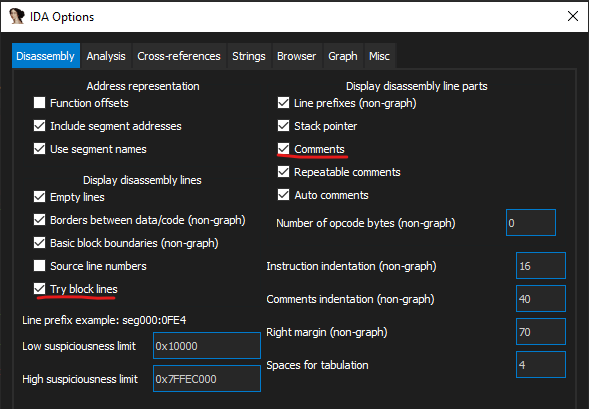
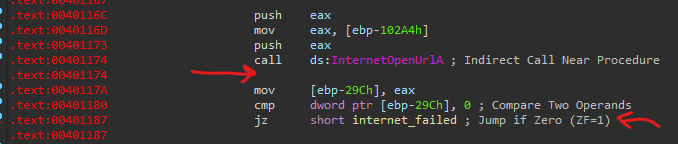

# Basic Analysis shortcuts

## Variables
 - Rename: `n`
 - Change number base:
   - Binary (2): `B`
   - Decimal (10): `H`
   - Hex (16): `Q`
   - ASCII: `R`
 - Cross reference: `X`

## Views
 - Pseudocode: `F5`
 - Strings: `Shift F12`


## Plugins

### Useful List
- Hex Copy
   - Simple single click to copy data as hex format
   - Shortcut: `Alt+H`
   - Link: https://github.com/OALabs/hexcopy-ida
 - Nop Selection
   - Clear selected assembly instruction or data
   - Shortcut: `Shift+N`
 - Flare IDA
   - Collection of IDA Pro scripts and plugins used by the FireEye Labs
   - Shellcode Hashes, Struct Typer, StackStrings, MSDN Annotations, ApplyCalleeType, idb2pat, argtracker, objc2_analyzer, ironstrings, Code Grafter
   - Link: https://github.com/mandiant/flare-ida
 - Interactive Functions List
   - Navigate between functions and their references
   - Shortcut: `Ctrl+Alt+F`
   - Link: https://github.com/hasherezade/ida_ifl
 - Fentanyl
   - Shortcuts to help in patching code easier
   - Link: https://github.com/osirislab/Fentanyl

### Installation
Simply move all code for plugin into the following directory:
```
%IDA%\plugins
```

If python install is not detected properly, use `idapyswitch.exe` to select manually. 

## Debugging

### Shortcuts
 - Breakpoint: `F2`
 - Step Into: `F7`
 - Step Over: `F8`

### Run dll files
1. Select local debugger



2. Set application to `C:\Windows\SysWOW64\rundll32.exe` and parameter as `<filename>, <function>`



3. Breakpoint DLL main to check that it works

  

## Repair Errors
1. Toggle between code and data
    - Code: `C`
    - Data: `D`

2. Modify irrelevant data to nop (`0x90`) instruction
    - Shortcut with nop plugin: `Shift-N`

## Misc
 - Save: `Ctrl+W`
 - Theme: Go to `Options > Colors` Click on the box Current `theme > Select Dark`
