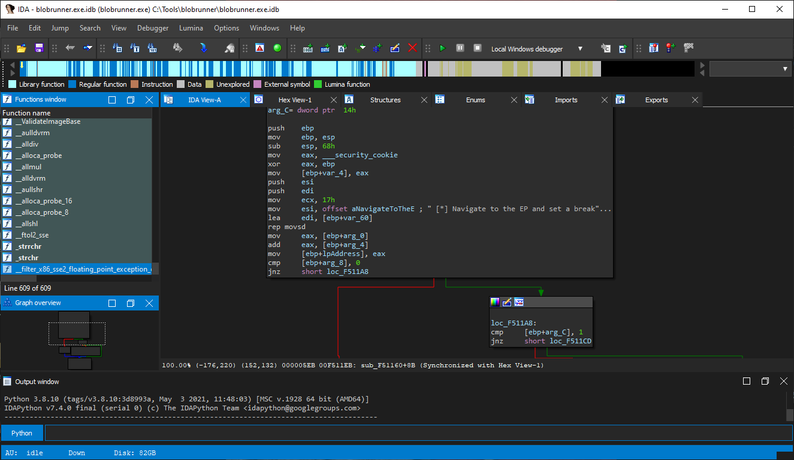
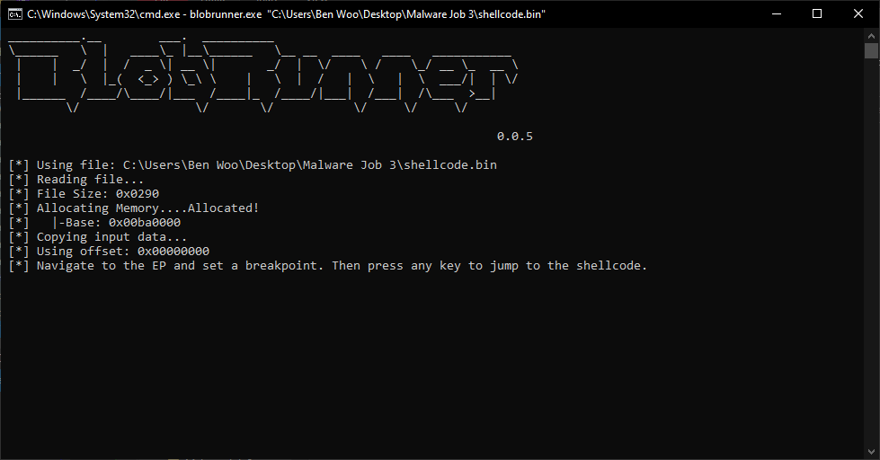
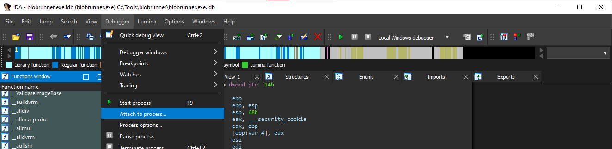
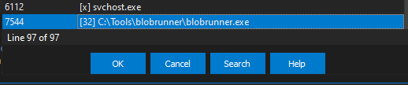
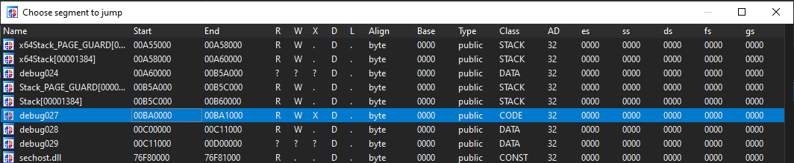
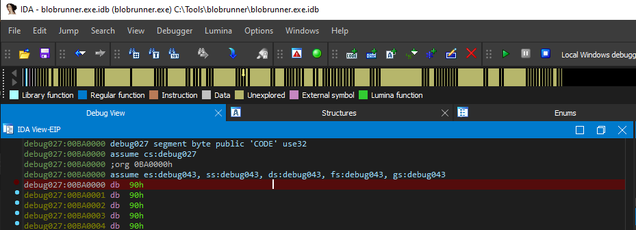

# ShellCode Analysis

## Tools
Some List: https://docs.remnux.org/discover-the-tools/dynamically+reverse-engineer+code/shellcode

### scdbg
- Analyze shellcode by emulating its execution.
- Website: http://sandsprite.com/blogs/index.php?uid=7&pid=152

### BlobRunner
- Allocate memory and execute shellcode for debugging
- Github: https://github.com/OALabs/BlobRunner

## Debugging Guide
https://www.youtube.com/watch?v=q9q8dy-2Jeg

### 1 - Open BlobRunner in IDA Pro

### 2 - Run ShellCode with BlobRunner

### 3 - Attach to process in IDA Pro

### 4 - Jump to ShellCode debug memory

## ShellCode Hashing
- https://www.mandiant.com/resources/blog/precalculated-string-hashes-reverse-engineering-shellcode
- https://github.com/OALabs/hashdb

