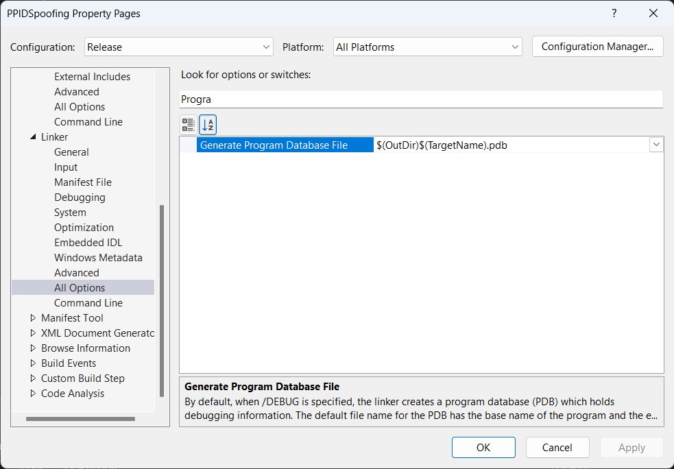
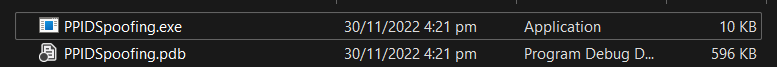
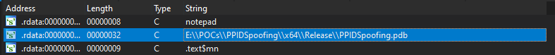
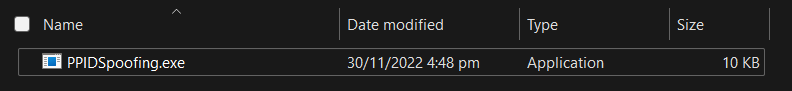
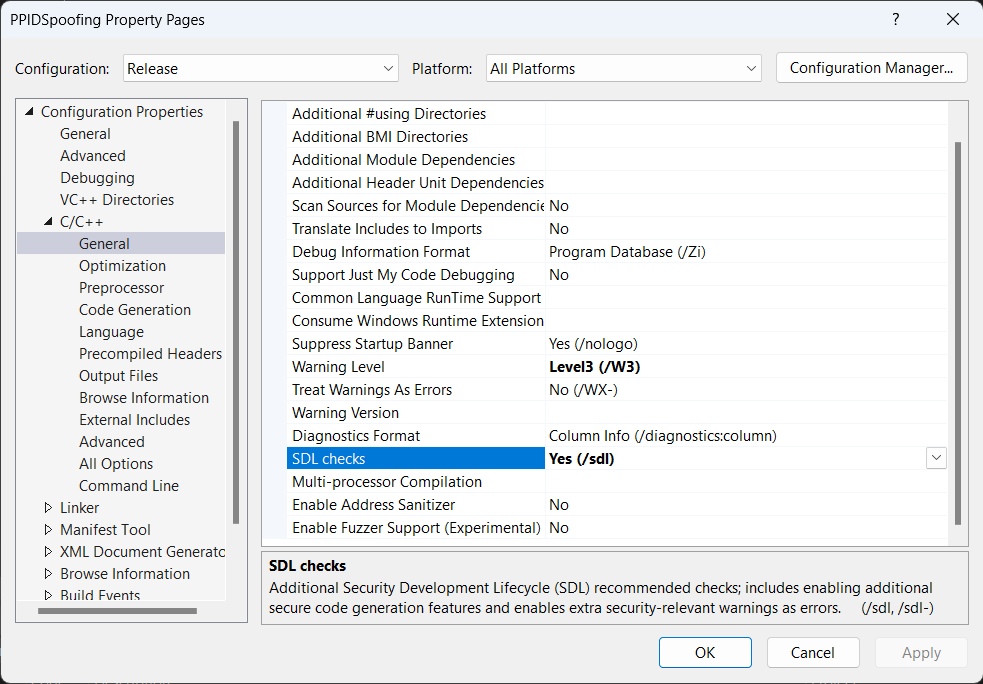
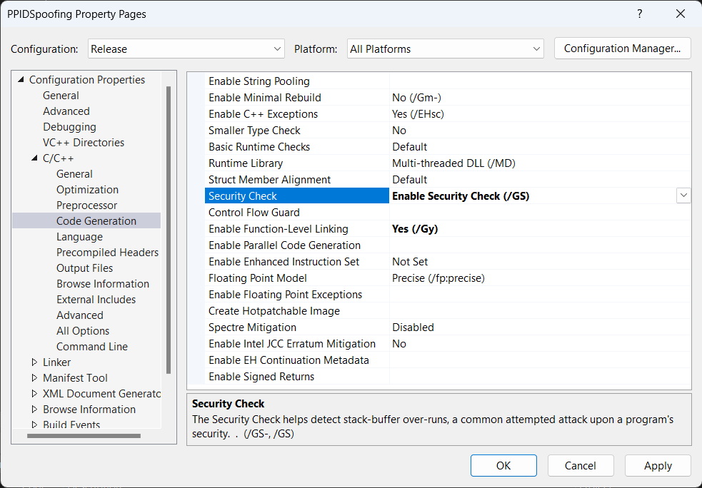
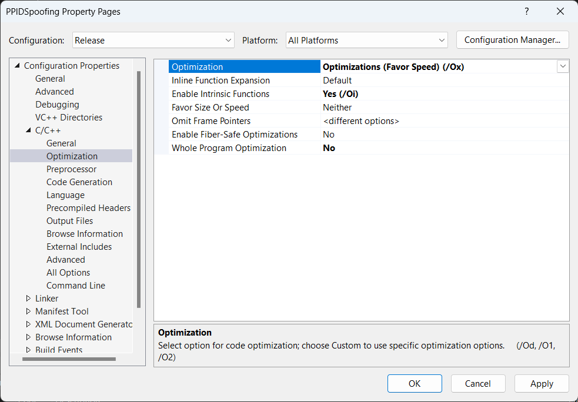
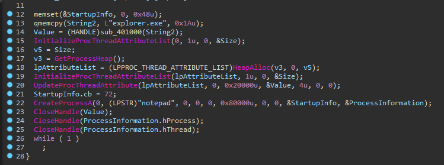
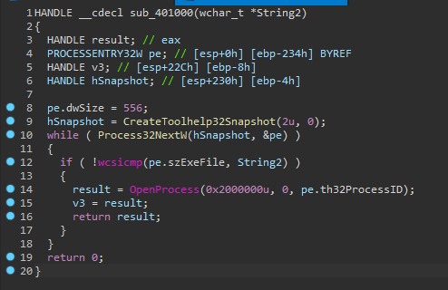
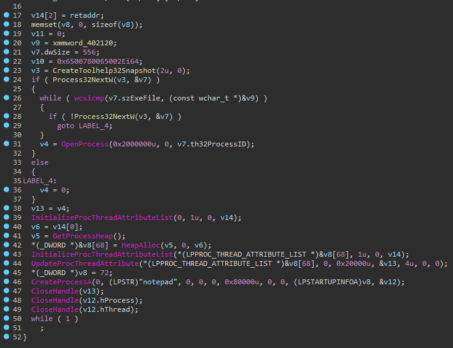

# Visual C++

## Build Configs

### Program Database
Program Database (PDB) file holds debugging and project state information that allows incremental linking of a Debug configuration of your app. Visual Studios have PDB enabled by default.

The setting for generating PDB file is under ``Linker -> Debugging`.

When building it will generate the exe along with the associated pdb. The exe will also have reference to the pbd's file path.

To disable generating PDB for release, set `Linker -> Debugging -> Generate Debug Info` to `No`.

If pdb is disabled, only the exe is generated during compilation:

### Security Checks

### Optimisations

When optimsations are disabled, the deassembled pseudocode has the same code structure as the source code. 

When optimsations are enabled, the subrountine is combined together as it is only used once.

