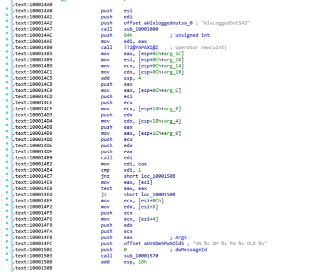

# Lab 11-01

## Findings

### PEiD

 - Likely not packed

### PEView

 - 32bit compiled
 - Likely modifying registry data
 - Likely reading and writing to a file
 - Likely modification of environment variables
 - Run cmdline commands
 - Retrieving various system information
 - Dynamic library being loaded

### Strings

 - Use of `gina.dll`
 - Method `WlxLoggedOutSAS`
 - Registry key `SOFTWARE\Microsoft\Windows NT\CurrentVersion\Winlogon`

### Executing

 - Outputs `DR` and `RI`
 - Created file named `msgina32.dll` 

### Regshot

 - Key: `HKLM\SOFTWARE\Microsoft\Windows NT\CurrentVersion\Winlogon\GinaDLL`
 - Value: `C:\Documents and Settings\Patrice\Desktop\Practical Malware Analysis Labs\BinaryCollection\Chapter_11L\msgina32.dll`

### IDA Pro

 - Wrapper for the actual `gina.dll`
 - Logging of username and password within `WlxLoggedOutSAS` method

 - Stores to a file named `msutil32.sys`

## Questions

### 1. What does the malware drop to disk?
The malware creates a dll file named “msgina32.dll”

### 2. How does the malware achieve persistence?
It adds the registry value GinaDLL to the key HKLM\SOFTWARE\Microsoft\Windows NT\CurrentVersion\Winlogon, with the data being the path to “msgina32.dll”. This allows 

### 3. How does the malware steal user credentials?
The contains a modified WlxLoggedOutSAS function that can retrieve user credentials. This method is called by windows when a user logout. 

### 4. What does the malware do with stolen credentials?
It writes the credentials obtained to a file named “msutil32.sys”.

### 5. How can you use this malware to get user credentials from your test environment?
Run the executable for the GinaDLL to be injected. Restart the computer, login and out of the user. After that, there should be a file named “msutil32.sys” with the user credentials.

