# Lab 11-02

## Findings

### PEiD
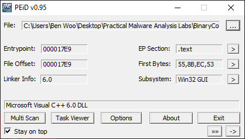

 - Likely not packed

### PE-Bear
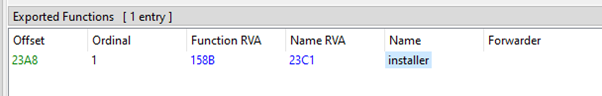  
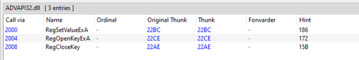  
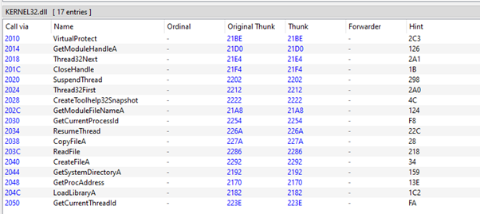  

 - Exports installer function, can be potentially called with `rundll32`

### Strings
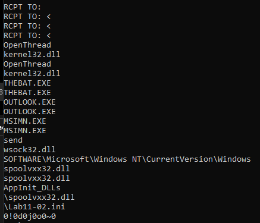  

 - DLLs hints:
   - `wsock32.dll` - Web sockets
   - `spoolvxx32.dll`
   - `AppInit_DLLs`
 - Registry key: `SOFTWARE\Microsoft\Windows NT\CurrentVersion\Windows`
 - Exe reference:
   - `THEBAT.EXE`
   - `OUTLOOK.EXE`
   - `MSIMN.EXE`

### IDA Pro
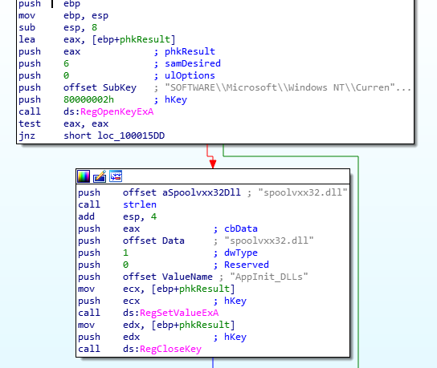  

 - Open registry key `SOFTWARE\Microsoft\Windows NT\CurrentVersion\Windows`
 - Set value `AppInit_DLLs` with data `spoolvxx32.dll`
 - Allows for persistence

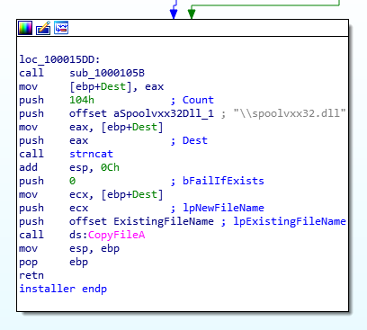  
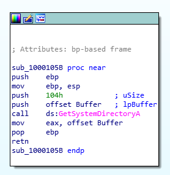  

 - Copy itself to system directory as a file named `spoolvxx32.dll`

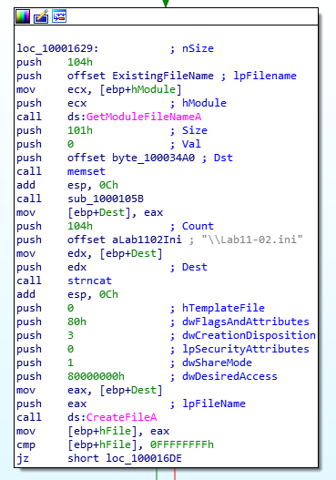  
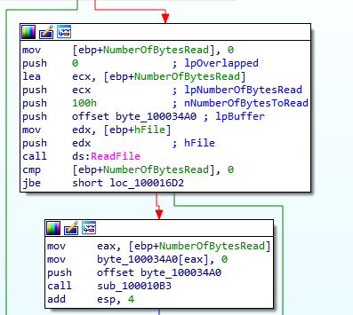  

 - Read the `Lab11-02.ini` file
 - There is some form of encryption going on
 - Likely it is the attacker’s email address

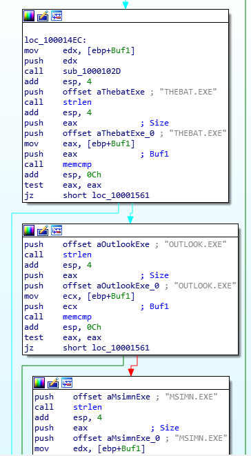  

 - Check if process is any of THEBAT.EXE, OUTLOOK.EXE or MSIMN.EXE

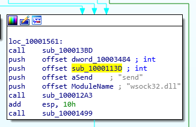  

 - Send data via web sockets if given exe file is present

### Executing
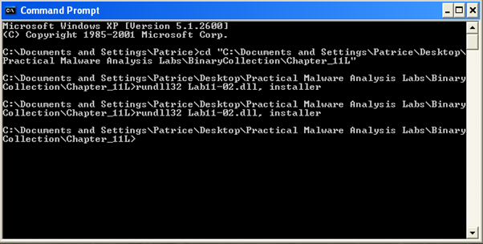  

 - Use rundll32 to execute the installer function

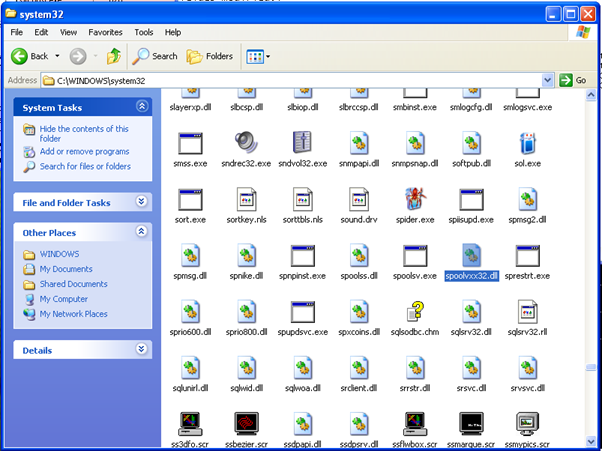  

 - `spoolvxx32.dll` is present in the system folder

### Hashing
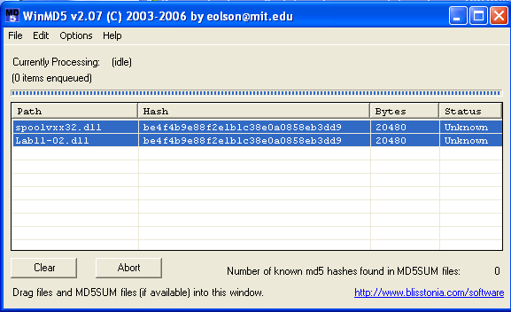  

 - `spoolvxx32.dll` is just a copy of itself (i.e the lab dll)

### RegShot
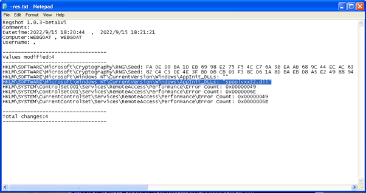  

 - Registry for `AppInit_DLLs` is modified to include `spoolvxx32.dll`
