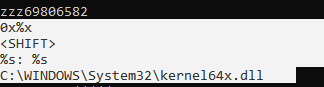

# Lab 11-03

## Findings

### PEiD
  
  

 - No packing detected

### PE-Bear
  
  
  

 - DLL does key logging
 - Create mutex to mark itself running
 - Likely writes keystroke to a file
 - EXE probably loads DLL and run exported function `zzz69806582`

### Strings
#### DLL
  
  

#### EXE
  

### IDA Pro
  
  
  
  

 - Copy file `Lab11-03.dll` to `C:\WINDOWS\System32\inet_epar32.dll`
 - String formatting `C:\WINDOWS\System32\cisvc.exe`
 - Inject `cisvc.exe`:
   - Open file and get map view
   - Read `.text` section data of executable file
 - Start cisvc network service with `net start cisvc`
   - Set environment variable for command prompt
   - Execute command

  

 - The exported function creates a new thread to activate malicious features
 - Calls a function named `StartAddress`

  
  
  
  
  
  

 - Create file named `C:\WINDOWS\System32\kernel64x.dll`
 - Loop forever to retrieve keystrokes and write to file
   - Get current window info
   - First gets the keystrokes of action keys
   - Then loop through all keys

### Process Monitor
  
  

 - `inet_epar32.dll` within strings of cisvc.exe
 - There is a thread present that calls `inet_epar32.dll`

### File Explorer
  
  

 - `inet_epar32.dll` present in system32
 - `kernel64x.dll` present in system32

### Hashing
  

 - `cisvc.exe` is edited, the hash before and after is different
 - `inet_epar32.dll` is just a copy of `Lab11-03.dll`

### Notepad
  

 - Data of keystrokes logged in file `kernel64x.dll`
