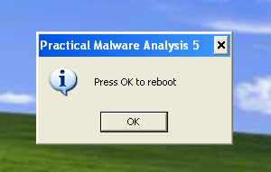
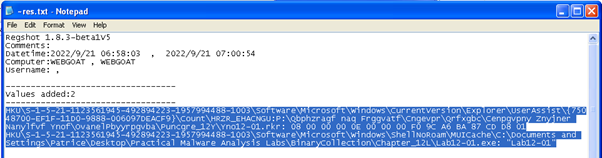

# Lab 12-01

## Findings

### Functions
#### EXE
  
  
  

 - Possible process injection to file explorer app
 - DLL being referenced

#### DLL
  
  

 - Possible creating popup with some message

### Executing
  

### RegShot
  

### Process Monitor
  

## Questions

### 1. What happens when you run the malware executable?
A message box keeps popping up every minute, which the number iterating

### 2. What process is being injected?
explorer.exe

### 3. How can you make the malware stop the pop-ups?
Kill the thread on Lab12-01.dll

### 4. How does this malware operate?
The malware enumerates all the running processes to find explorer.exe process. Then it loads the Lab12-01.dll into the parent explorer.exe, and the malicious dll will run within explorer.exe
