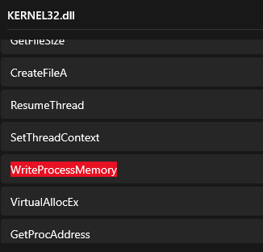
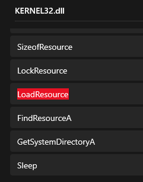
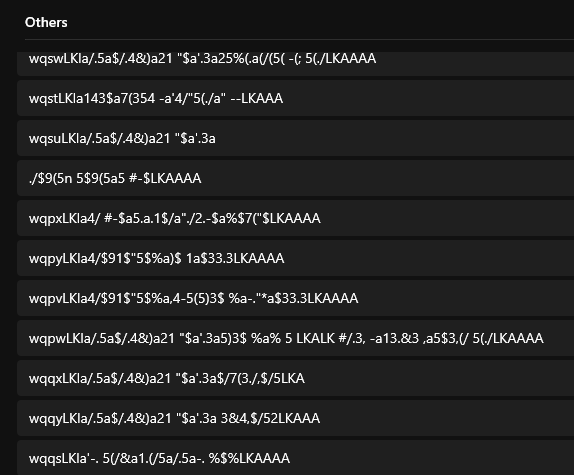
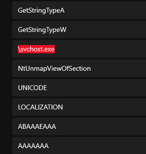
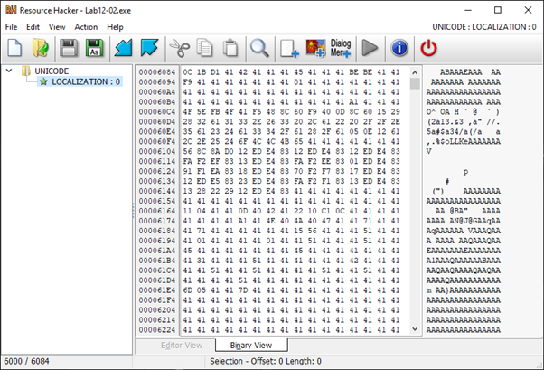
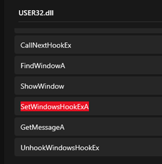
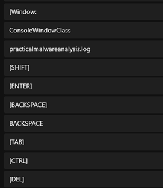
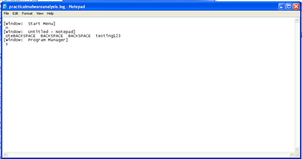
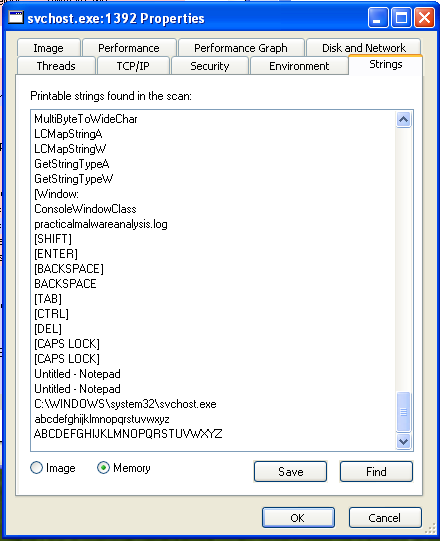
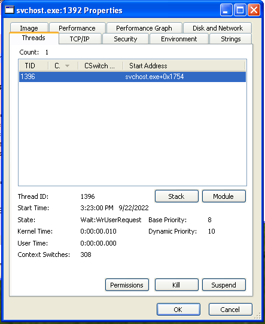

# Lab 12-02

## Findings

### Functions
  
  

 - Modification of process memory
 - Loading of resource within executable

### Strings
  
  

 - Some form of encrypted data
 - svchost.exe being used

### ResourceHacker
  

 - Some hidden data, but seems to be encrypted 

### Pseudocode
```py
def main():
    hModule = GetModuleHandleA(null)
    ApplicationName = SystemDir + '\\svchost.exe'
    lpAddress = GetResource(hModule)
    InjectProcess(ApplicationName, lpAddress)
    memset(ApplicationName, null, 1024)
    VirtualFree(lpAddress)
    Sleep(1000)

def GetResource(hModule) -> AllocatedMem:
    hResInfo = FindResourceA("UNICODE", "LOCALIZATION")
    hResData = LoadResource(hModule, hResInfo)
    Src = LockResource(hResData)
    dwSize = SizeofResource(hModule, hResInfo)
    AllocatedMem = VirtualAlloc(null, dwSize, 4096, 4)
    memcpy(AllocatedMem, Src, dwSize)
    if (AllocatedMem[0:2] != "MZ"):
        DecryptResource(AllocatedMem, dwSize)
    FreeResource(hResInfo)
    return AllocatedMem

def DecryptResource(AllocatedMem):
    for each byte in AllocatedMem:
        xor byte with "A"

def InjectProcess(ApplicationName, lpAddress):
    # check MZ
    # check EP
    memset(StartupInfo, null, 68)
    memset(ProcessInformation, null, 16)
    CreateProcessA(lpApplicationName, ..., StartupInfo, ProcessInformation)
    lpContext = VirtualAlloc(null, 716, 4096, 4)
    GetThreadContext(ProcessInformation.hThread, lpContext)
    ReadProcessMemory(ProcessInformation.hProcess, lpContext@A4h, Buffer, 4, 0)
    NtUnmapViewOfSection(ProcessInformation.hProcess, Buffer)
    # Write resource file into process memory
```

### Resource File

#### Decryption Code
```py
b = bytearray(open('Lab12-02.res', 'rb').read())
for i in range(len(b)):
    b[i] ^= 0x41
open('Lab12-02.out', 'wb').write(b)
```

#### Strings
  
  

#### Pseudocode
```py
def main():
    AllocConsole()
    hWnd = FindWindowA("ConsoleWindowClass", null)
    ShowWindow(hWnd, null)
    hMod = GetModuleHandleA(null, null)
    SetWindowsHookExA(13, fn, hMod)
    GetMessageA(null, null, null, null)

def fn(int code, WPARAM wParam, LPARAM lParam):
    if wParam == 260 or 256:
        LogKeystoke(lParam)
    CallNextHookEx()

def LogKeystoke(Buffer):
    hFile = CreateFileA("practicalmalwareanalysis.log", ...)
    hWnd = GetForegroundWindow(Str2, 1024)
    Str2 = GetWindowTextA(hWnd)
    if Str2 != Str1:
        # Write file "\r\n[Window: {Str2} ]\r\n"
        Str1 = Str2
    # Write key pressed to file
```

### Executing
  

 - Data of keys being logged

### Process Monitor
  

 - Evidence of keylogger code being injected into svchost.exe process

  

 - Only a single thread running, which is weird of svchost process
