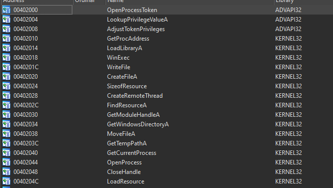
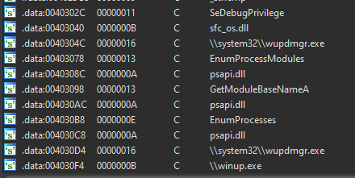
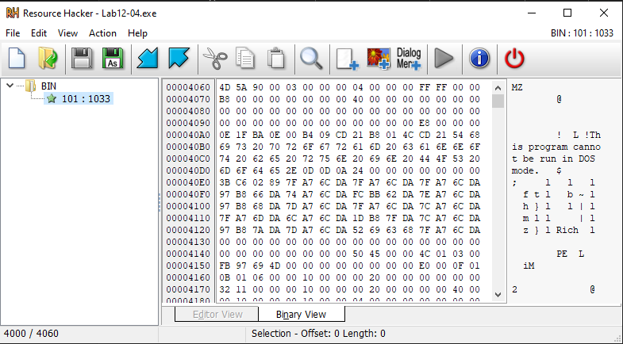
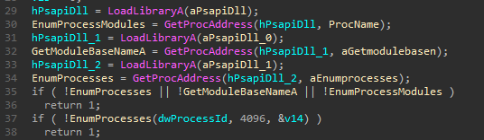
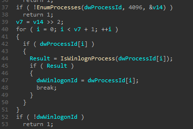
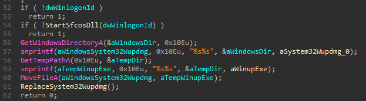
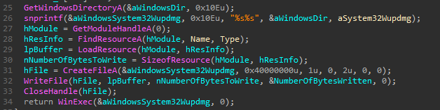
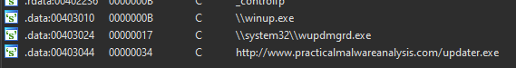
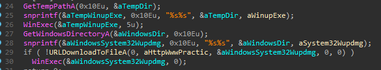

# Lab 12-04

## Findings

### Functions
  

 - Loading of resource
 - Writing file
 - Create thread in remote process
 - Possible process injection

### Strings
  

 - Use of `psapi.dll` and `sfc_os.dll`
 - File reference of `\system32\wupdmgr.exe`
 - File reference of `\winup.exe`

### Resource Hacker
  

### IDA Pro
  

 - Dynamically load in process related function calls from `psapi.dll`

  

 - Loop through all the process to find `winlogon.exe`

  

 - Move the original `wupdmgr.exe` to `winup.exe` temp folder

  

 - Replace the `wupdmgr.exe` with resource file stored in the executable

### Resource File
 - This is the spoofed `wupdmgr.exe` file.

#### Strings
  

 - URL endpoint of http://www.practicalmalwareanalysis.com/updater.exe
 - Similar file reference of `wupdmgr.exe` and `\winup.exe`

#### IDA Pro
  

 - Execute the `winup.exe` file, which is the original `wupdmgr.exe`.
 - Downloads a file from the url http://www.practicalmalwareanalysis.com/updater.exe.
 - Replace this spoofed file with the downloaded file.
 - If download failed, run the spoofed file again to retry.

## Questions
### 1. What does the code at 0x401000 accomplish?
Check if the given process is `winlogon.exe`.

### 2. Which process has code injected?
The `winlogon.exe` process.

### 3. What DLL is loaded using LoadLibraryA?
`sfc_os.dll`

### 4. What is the fourth argument passed to the CreateRemoteThread call?
The start address of a function in `sfc_os.dll`.

### 5. What malware is dropped by the main executable?
An executable that sends a web request to download another executable file.

### 6. What is the purpose of this and the dropped malware? 
To fetch an malicious executable from http://www.practicalmalwareanalysis.com/updater.exe and will alter the behaviour of windows update for malicious purposes.
