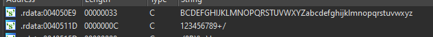
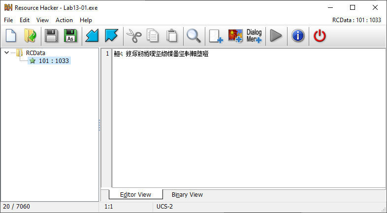
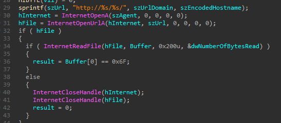

# Lab 13-01

## Findings

### Functions
  

 - API calls to access network

  

 - Possible hidden resource file(s) within the executable

### Strings
  

 - Reference to URL, but only placeholders

  

 - Array of letter mappings

### Resource Hacker
  

 - Some hidden data that looks encrypted

### Resource Decryption
  

 - Resource data seems to encrypted with XOR of `0x3B`

  

 - Using cyberchef to decrypt, it is a url link `www.practicalmalwareanalysis.com`

### Hostname Encryption
  

 - Base64 table detected

  

 - Base64 used to encode the hostname

### Internet Access
  

 - The url formatting is `http://www.practicalmalwareanalysis.com/<base64_hostname>`
 - Reads data from the url endpoint
 - Success if 1st byte of data is `0x6F`

### Overall Purpose
   

 1. Decode the attacker's domain.
 2. Transmit the user's hostname to the attacker's server.
 3. Retry in 30 seconds if internet connection fails.

## Questions
###  1. Compare the strings in the malware (from the output of the strings command) with the information available via dynamic analysis. Based on this comparison, which elements might be encoded?
The url to the attacker's server is encoded.

###  2. Use IDA Pro to look for potential encoding by searching for the string xor. What type of encoding do you find?
There is an `xor` instruction performed with `0x3B`

### 3. What is the key used for encoding and what content does it encode?
The key is `0x3B`. It stores the url domain of the attacker `http://www.practicalmalwareanalysis.com/<base64_hostname>`

### 4. Use the static tools FindCrypt2, Krypto ANALyzer (KANAL), and the IDA Entropy Plugin to identify any other encoding mechanisms. What do you find?
It is able to detect that the Base64 table is used.

### 5. What type of encoding is used for a portion of the network traffic sent by the malware?
XOR encoding.

### 6. Where is the Base64 function in the disassembly?
The function is found at `0x004010B1`

### 7. What is the maximum length of the Base64-encoded data that is sent? What is encoded?
The maximum length is 16. The hostname is being encoded.

### 8. In this malware, would you ever see the padding characters (= or ==) in the Base64-encoded data?
No.

### 9. What does this malware do?
Transmit the user's hostname to the attacker's server.
