# Lab 13-03

## Findings

### PEiD
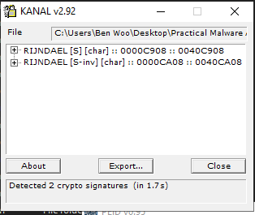

### Functions
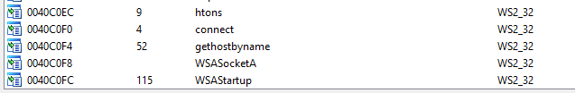
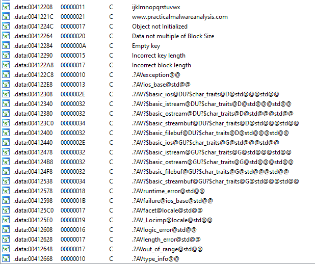

### IDA Pro

#### Overall main function
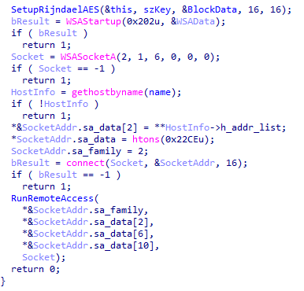

1. Initialise AES cipher with key as `ijklmnopqrstuvwx`
2. Startup web socket connection to `www.practicalmalwareanalysis.com` at port `8910`
3. Use the web socket to execute remote access function

#### Setting up encryption
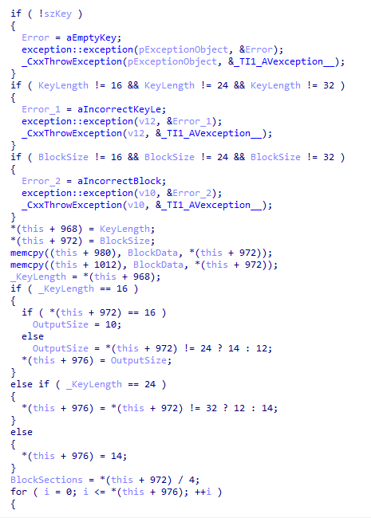

 - Key length: 16, 24 or 32
 - Block size: 16, 24 or 32
 - Output size:
   - key 16:
     - block 16: 10
     - block 24: 12
     - block 32: 14
 - key 24:
     - block 16/24: 12
     - block 32: 14
 - key 24:
     - block 16/24/32: 14
 - Set entire Block to NULL at offset 8
 - Set entire Output to NULL at offset 488

#### Starting backdoor
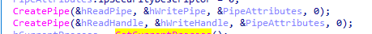

 - 2 pipes are created from reading and writing between socket and command line

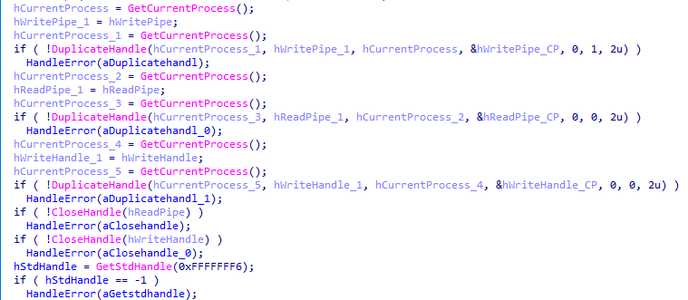

 - 

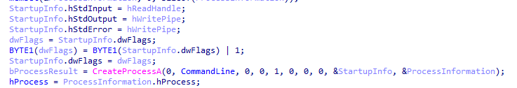

 - 

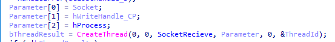

 - 

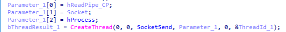

 - 

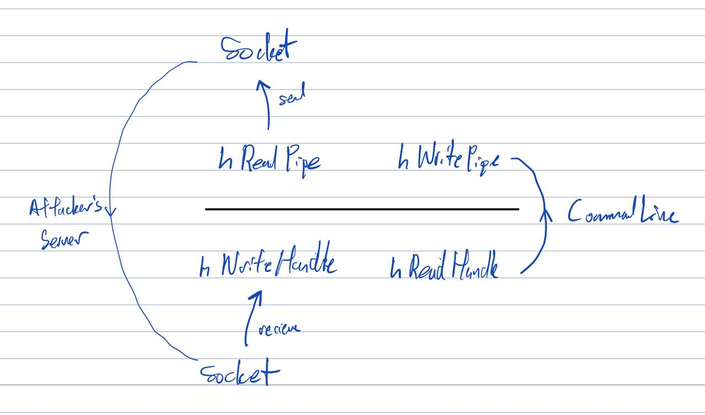

 - Overall diagram of how the attacker communicate with victim's command line

### Notes
 - Rigndael cipher is used
 - Attacker creates a backdoor with shell access