# Lab 13-03

## Findings

### PEiD
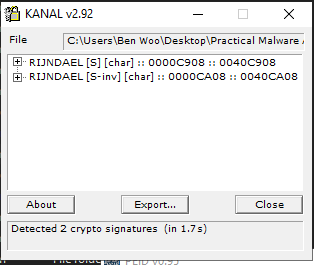

 - Use of KANAL plugin
 - Detected AES SBOX
 - Detected AES inverse SBOX for decryption

### Functions
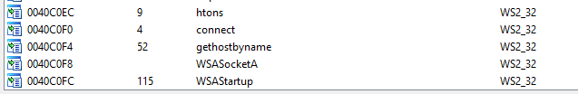

 - Web related API functions imported by executable

### Strings
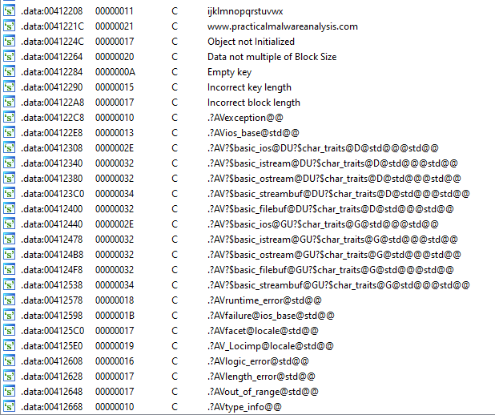

 - References to key and block data, which hints encryption involved
 - Web URL potentially to the attacker's server

### IDA Pro

#### Overall main function
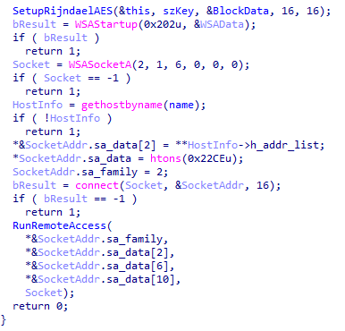

1. Initialise AES cipher with key as `ijklmnopqrstuvwx`
2. Startup web socket connection to `www.practicalmalwareanalysis.com` at port `8910`
3. Use the web socket to execute remote access function

#### Setting up encryption
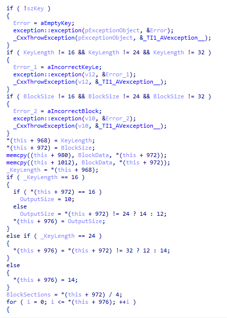

 - Looks like AES encryption setup

 - Key length: 16, 24 or 32
 - Block size: 16, 24 or 32
 - Output size:
   - key 16:
     - block 16: 10
     - block 24: 12
     - block 32: 14
 - key 24:
     - block 16/24: 12
     - block 32: 14
 - key 24:
     - block 16/24/32: 14
 - Set entire Block to NULL at offset 8
 - Set entire Output to NULL at offset 488

#### Starting backdoor
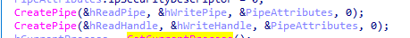

 - 2 pipes are created from reading and writing between socket and command line
 - hReadPipe, hReadHandle, hWritePipe, hWriteHandle

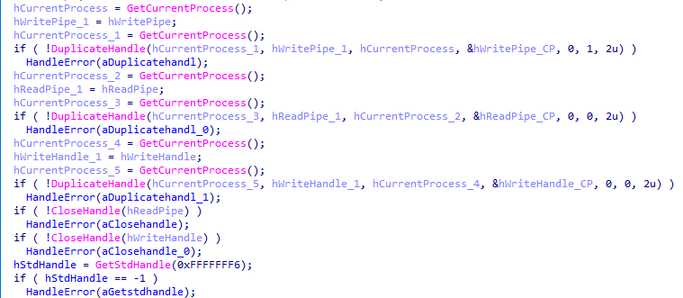

 - Series of duplicating handles, but essentially still the same 4 pipe handlers

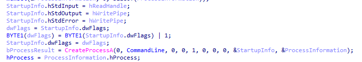

 - Creates a new command line process

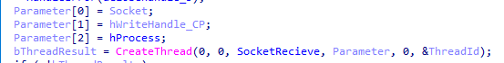

 - Creates a thread to receive data from socket and run in command line

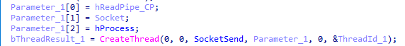

 - Creates a thread to get output from command line and send to socket

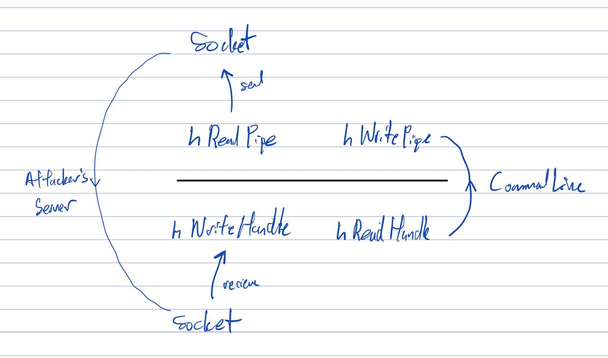

 - Overall diagram of how the attacker communicate with victim's command line

### Notes
 - Rigndael cipher is used
 - Attacker creates a backdoor with shell access

## Questions
### 1. Compare the output of strings with the information available via dynamic analysis. Based on this comparison, which elements might be encoded?

### 2. Use static analysis to look for potential encoding by searching for the string xor. What type of encoding do you find?

### 3. Use static tools like FindCrypt2, KANAL, and the IDA Entropy Plugin to identify any other encoding mechanisms. How do these findings compare with the XOR findings?

### 4. Which two encoding techniques are used in this malware?

### 5. For each encoding technique, what is the key?

### 6. For the cryptographic encryption algorithm, is the key sufficient? What else must be known?
 - The size of block

### 7. What does this malware do?
 - Creates a reverse shell with an encrypted remote connection to the attacker via socket

### 8. Create code to decrypt some of the content produced during dynamic analysis. What is this content?

