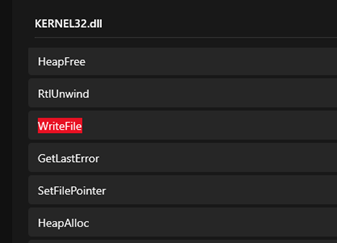

# Lab 14-01

## Findings

### Functions
  
  

 - Function to obtain user information
 - Downloading file from the internet

### Strings
  

 - Possible url endpoint used to contact the attacker’s server

### IDA Pro
  
  

 - Get and format user information
 - hh:hh:hh:hh:hh:hh-username

  
  

 - Generated some form of string sequenced based on local user profile string
 - `Stack[00000B3C]:0018FDD0 	80:6e:6f:6e:69:63-Ben Woo`
 - `Stack[00000B3C]:0018FF30	ODA6NmU6NmY6NmU6Njk6NjMtQmVuIFdvbwaa`

  

 - Base64 encode local user profile string
 - Slightly different from normal Base64, encoding ends with padding `aa` instead of `==`

  
  

 - Generated network url endpoint
 - `Stack[00000484]:0018FBB4 http://www.practicalmalwareanalysis.com/ODA6NmU6NmY6NmU6Njk6NjMtQmVuIFdvbwaa/a.png`
 - Format: http://www.practicalmalwareanalysis.com/<string>/<lastchar_of_string>.png

  

 - Run the downloaded file in a new process
 - Downloaded file likely a malicious executable disgust as .png file extension

  

 - Tries again 1 minute later if web request fails

### DNS Request Capture
  

 - Requests to malicious domain detected
