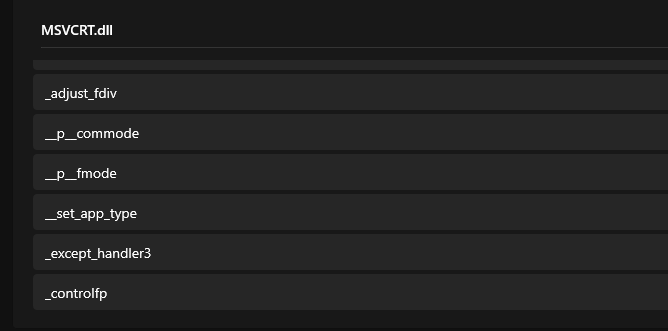
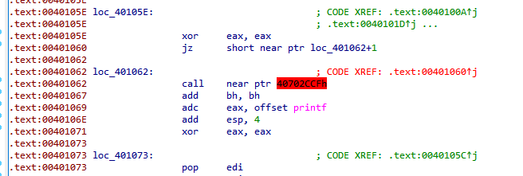
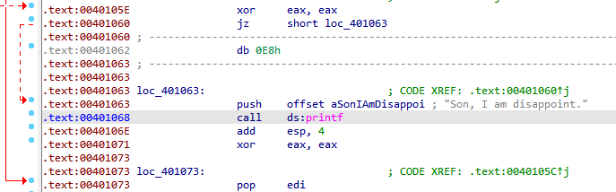
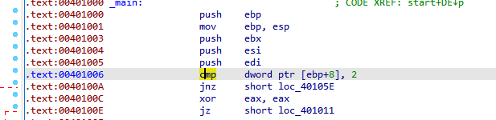
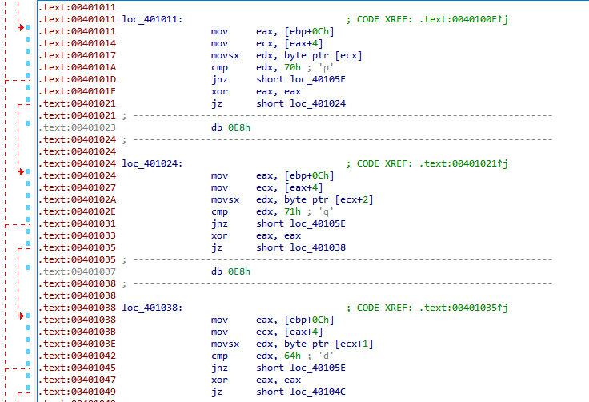
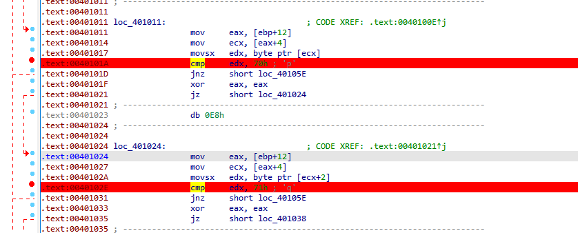
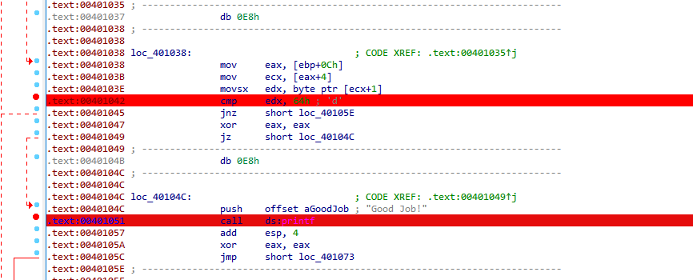
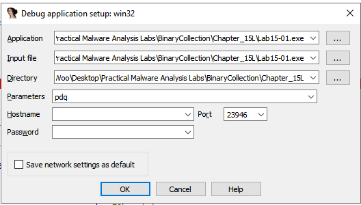
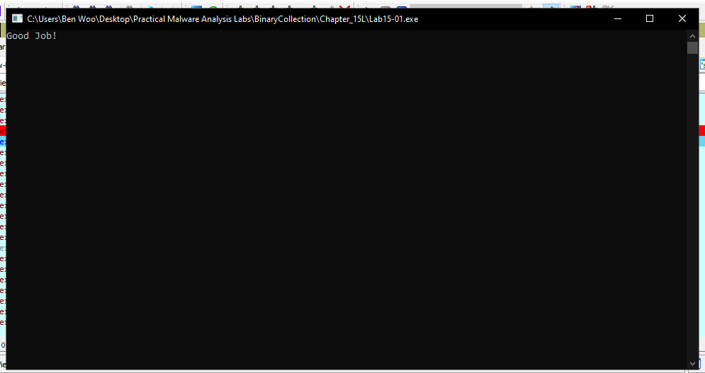

# Lab 15-01

## Findings

### Strings

 - Presents of some output messages

### Functions
  

 - Executable only imports MSVCRT functions, no windows API calls

### IDA Pro

#### Disassembly errors

 - There are some disassembly errors:
   - Jump instruction with a constant condition
   - Multilevel inward-jumping sequence

 - Convert the irrelevant code into data, shows only the instructions that are relevant to understanding the program
 - Change `0x00401062` to data, `0x00401063` now chnages to `push offset aSonIAmDisappoi`
 - Do that to all similar disassembly errors

#### Check argument counts

 - `[edp+8]` represents the argc, number of argument 
 - Ensure that there is 1 argument value

#### Check for string sequences

 - eax[0] -> p
 - eax[2] -> q
 - eax[1] -> d
 - The command line argument string must start with `pdq`

#### Set breakpoints

 - Set breakpoints at checks for argument, string sequence and printf output

#### Executing with correct payload

 - Set parameter to `pdq`

  

 - The output is `Good Job!`, means the checks were successful

## Questions

### 1. What anti-disassembly technique is used in this binary?
 - Jump instruction with a constant condition
 - Multilevel inward-jumping sequence

### 2. What rogue opcode is the disassembly tricked into disassembling?
 - `call`
 - `E8h`

### 3. How many times is this technique used?
 - 5 times

### 4. What command-line argument will cause the program to print "Good Job!"?
 - `pdq`
