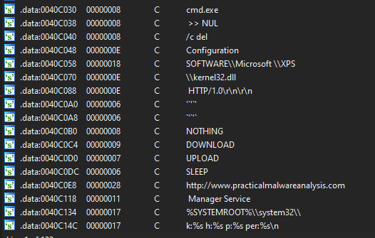
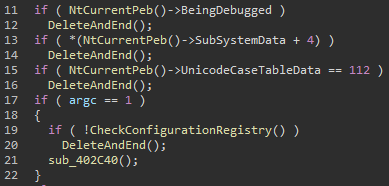
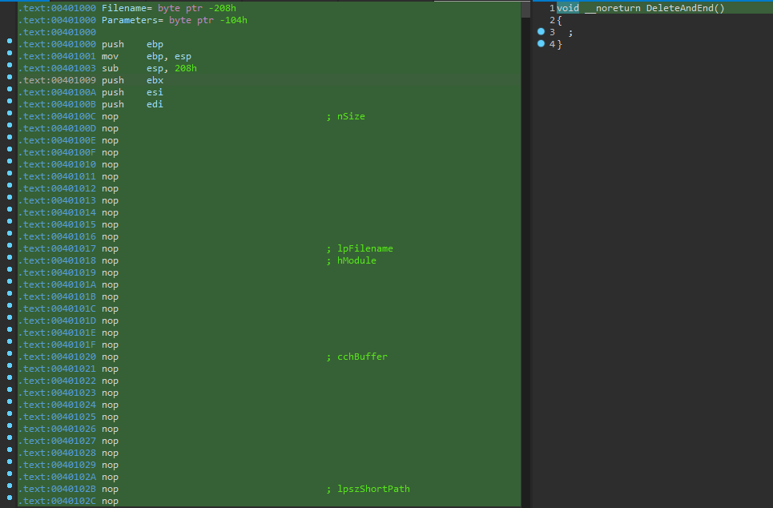
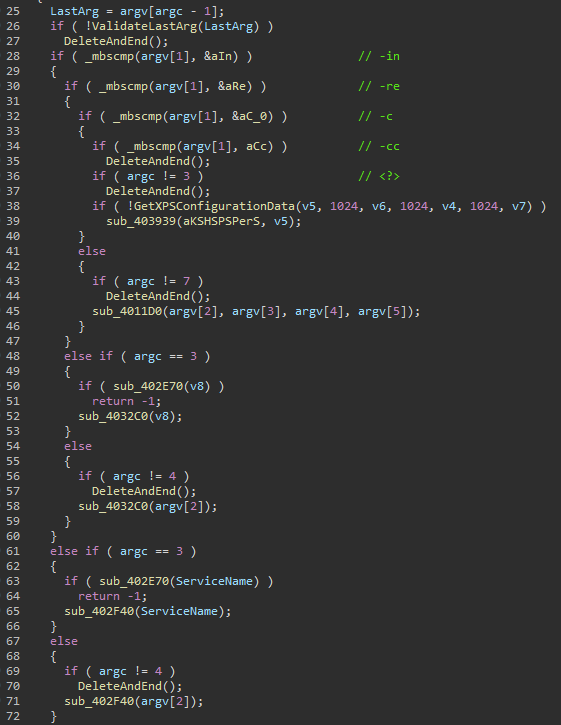

# Lab 16-01

## Findings

### Strings
  

### Anti-Debugging checks
  

  

### Analysis commandline arguments
  

`-in [?] <last>`

`-re <2> <3> <4> <5> <last>`

`-c <last>`

`<?> [service_name] <last>`

## Questions
### 1. Which anti-debugging techniques does this malware employ?
It checks the process environment block for properties that indicate a debugging environment.

### 2. What happens when each anti-debugging technique succeeds?
It will run a shell command that deletes itself.

### 3. How can you get around these anti-debugging techniques?
Replace the entire delete function with `nop` instructions. 

### 4. How do you manually change the structures checked during runtime?
IDA Pro can be used to edit the stack data and change the properties of PEB struct to remove debugging traces.

### 5. Which OllyDbg plug-in will protect you from the anti-debugging techniques used by this malware?

